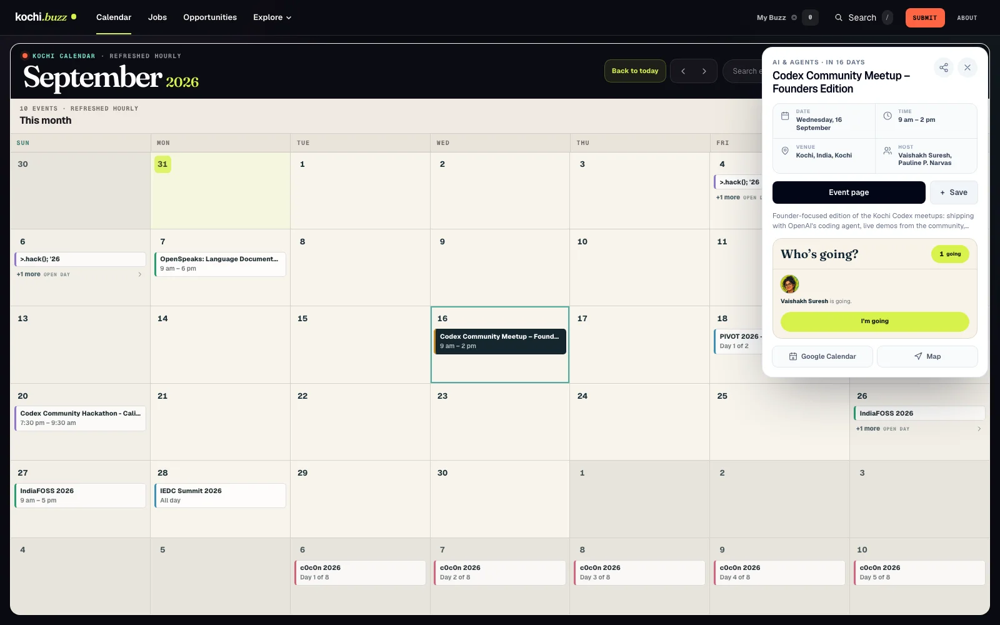
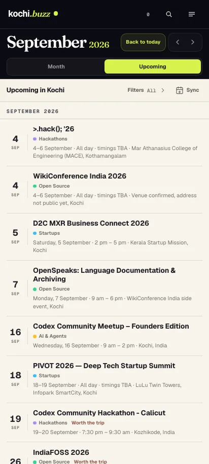
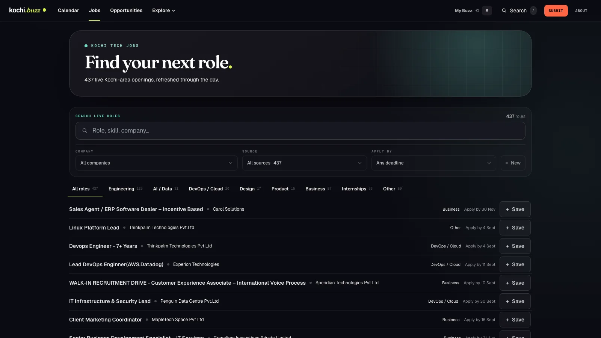
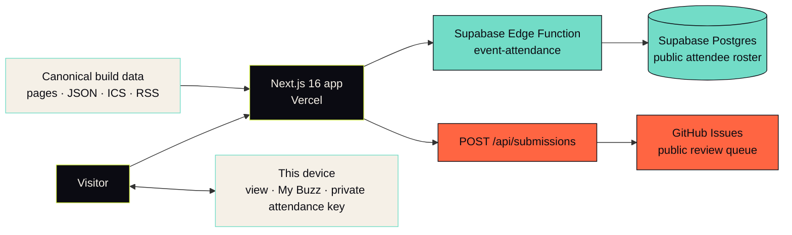
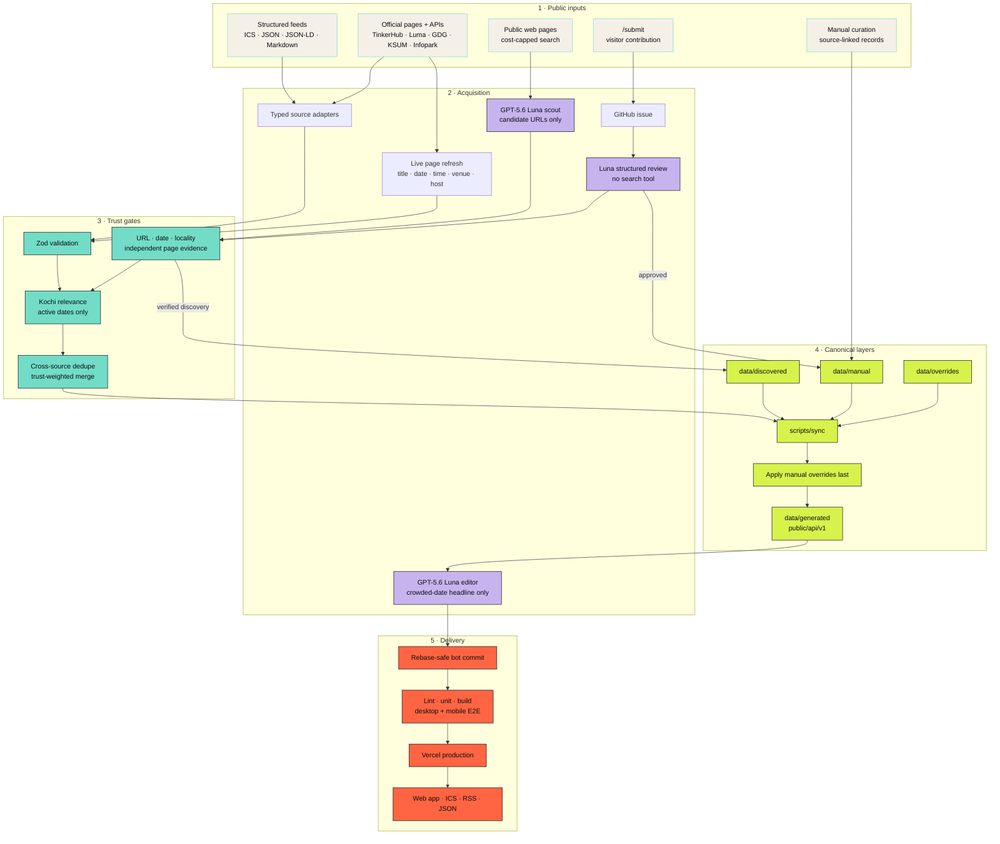

<p align="center">
  <a href="https://kochi.buzz" aria-label="Open kochi.buzz">
    
  </a>
</p>

<h1 align="center">kochi.buzz</h1>

<p align="center"><strong>Kochi’s tech scene, by date.</strong></p>

<p align="center">
  Because discovering a meetup the morning after it happened is not a discovery system.
</p>

<p align="center">
  <a href="https://kochi.buzz"></a>
  <a href="https://github.com/vaishakh3/kochibuzz/actions/workflows/quality.yml"></a>
  <a href="https://github.com/vaishakh3/kochibuzz/actions/workflows/sync-data.yml"></a>
</p>

<p align="center">
  <a href="https://kochi.buzz">
    
  </a>
</p>

## Why this exists

I organise a lot of events. I turn up to a lot of them too. The awkward part was
finding them: one date lived on Luma, another in a community page, another in a
chat I would remember three days too late. Good events clashed simply because
there was no clean view of the month.

Kochi Buzz started as my personal fix and became useful enough to make public.
Open it and you get the calendar—no landing-page obstacle course, no account,
no feed, and no algorithm asking about your hobbies before admitting that
Tuesday exists.

The focus is technology, startups, makers and creative tech in and around Kochi.
The rest of the product follows the same rule: **be immediately useful, then get
out of the way.**

## What you can do

| | |
| --- | --- |
| **See the city at a glance** | Month, week, day and compact mobile schedule views share one date, search and filter state. |
| **Open a useful event brief** | Date, time, venue, host, source, registration, Google Calendar and Maps stay in one glanceable card. |
| **Say “I’m going” without an account** | Pick a Kochi avatar and a name. The public roster lives in Supabase; the private ownership key stays on the device. |
| **Keep a private shortlist** | My Buzz saves events, jobs and opportunities in local storage. No profile required. |
| **Find work** | Search and filter Kochi-area roles aggregated from Infopark and direct company hiring feeds. |
| **Contribute from the site** | Submit an event, opportunity, project, community or data source through a first-party form. |
| **Use the data elsewhere** | Subscribe through ICS, follow RSS, or consume the versioned JSON endpoints. |

### One product, two densities

Desktop is a datebook; mobile is a clean “what’s next” list. The jobs desk uses
the same visual language without forcing calendar controls onto the wrong job.

<table>
  <tr>
    <td width="32%" valign="top">
      
    </td>
    <td width="68%" valign="top">
      
    </td>
  </tr>
  <tr>
    <td align="center"><sub>Upcoming dates, designed for a thumb.</sub></td>
    <td align="center"><sub>Live Kochi-area roles, designed for an actual search.</sub></td>
  </tr>
</table>

## The product map

| Route | What lives there |
| --- | --- |
| [`/`](https://kochi.buzz) | The Kochi calendar: month, week, day, schedule, search, filters and My Buzz |
| [`/events/<id>`](https://kochi.buzz/events/codex-meetup-kochi-founders) | Canonical event page with JSON-LD, share card and calendar actions |
| [`/jobs`](https://kochi.buzz/jobs) | Kochi-area jobs with text, category, company, source and deadline filters |
| [`/opportunities`](https://kochi.buzz/opportunities) | Hackathons, grants, fellowships, accelerators and open calls |
| [`/built`](https://kochi.buzz/built) | Products and projects built in and around Kochi |
| [`/communities`](https://kochi.buzz/communities) | Active tech communities and their upcoming dates |
| [`/places`](https://kochi.buzz/places) | Maker spaces, hubs, coworking rooms and useful places to meet |
| [`/digest`](https://kochi.buzz/digest) | The next 30 days in one compact, shareable list |
| [`/submit`](https://kochi.buzz/submit) | First-party contribution forms backed by a public GitHub review queue |
| [`/about`](https://kochi.buzz/about) | Source registry, provenance, feeds and how the data moves |

## Architecture

Kochi Buzz has two deliberately separate halves:

1. a mostly static, fast Next.js product built from canonical JSON; and
2. small write paths for public submissions and account-free attendance.

The OpenAI API never sits in the visitor request path. It is used only by
bounded background workers for discovery and submission review.



### The publication pipeline

The pipeline accepts structured feeds, official pages, hand-curated records,
public submissions and carefully bounded web discovery. Every path converges on
the same deterministic checks before anything reaches the website.



### What happens on each run

#### Hourly deterministic sync

`.github/workflows/sync-data.yml` runs at minute 17 of every hour. The worker:

1. fetches enabled sources with the transparent `KochiBuzzBot/1.0` user agent,
   a 15-second timeout, one retry and small concurrency;
2. parses source-specific formats through tested adapters;
3. validates every record individually with Zod;
4. keeps Kochi-relevant, active records and drops expired automated entries;
5. merges cross-posted events, jobs and opportunities using source trust;
6. applies manual corrections last; and
7. atomically writes `data/generated/` and the versioned public API mirrors.

If a source fails—or suddenly returns zero after returning plenty—the last valid
records from that source survive. A broken parser is not allowed to conclude
that Kochi has been cancelled.

Curated Luma event URLs receive an extra live refresh. The stable Kochi Buzz ID,
summary, tags and attendance remain intact while changed titles, dates, times,
venues and hosts are pulled from the source page.

TinkerHub is read from its official public event feed every hour. The adapter
accepts only public events with explicit Kochi locality or TinkerSpace
Kalamassery (space 1), converts UTC timestamps to IST, and excludes campus-only
and other-city records. Long cohort windows are published on their opening date
with the programme end retained as context, so one course cannot paint over an
entire month of the calendar.

When several events begin on the same date, a separate Luna editorial pass
chooses the one visible month-grid headline. Decisions are cached against the
candidate data, so unchanged dates cost no additional API call. The browser
never calls OpenAI: it reads the committed choice, falls back deterministically,
and keeps continuing multi-day events behind the day view after opening day.

#### Public-web discovery, every 12 hours at most

`scripts/discovery/events.ts` uses the OpenAI Responses API and
`gpt-5.6-luna` to look for public event pages missing from registered feeds.
The model proposes URLs; it does **not** get to publish facts by confidence or
vibes. An event is accepted only when the page independently confirms its title,
date and greater-Kochi location, the date falls within the next 120 days, the URL
is safe and public, and the event is not already known.

Unclear social or news leads land in `data/discovered/review.json`, not on the
calendar. Discovery is limited to four measured search actions and 20 candidates
per due run. With the current schedule and model, the measured budget is roughly
**$2.80/month**. If OpenAI is unavailable, the ordinary source sync continues.

#### Public submissions

`/submit` validates and formats contributions before creating a labelled GitHub
issue. If `GITHUB_SUBMISSIONS_TOKEN` is unavailable, the form keeps the entered
data and opens a prepared issue for the visitor instead.

`.github/workflows/review-submissions.yml` treats the issue text and linked page
as untrusted input. Events, opportunities, projects and communities are added
automatically only when the official page is reachable, deterministic evidence
checks pass, every structured review check passes, and confidence is at least
0.90. Ambiguous items remain open for a maintainer. New scraper definitions
always require manual security review.

## Data layers

Generated files are products of the pipeline, not editing surfaces.

```text
data/
├── sources/      registry.json: every automated source and its trust level
├── manual/       source-linked records maintained by people
├── discovered/   verified web discoveries + leads awaiting review
├── overrides/    per-ID corrections that always win
├── state/        first-seen dates, source counts and discovery schedule
└── generated/    canonical output consumed by the app — do not hand-edit
```

Supported adapters currently cover Infopark HTML, Lever JSON, Workable Markdown,
Luma/GDG Schema.org JSON-LD, public ICS calendars, and Kerala Startup Mission’s
official event, careers and tender endpoints. Global feeds are filtered again
locally; a calendar being global does not make every entry a Kochi event.

## Machine-readable feeds

All JSON endpoints use `schemaVersion: 1`.

| Format | Endpoint | Good for |
| --- | --- | --- |
| Calendar | [`/calendar.ics`](https://kochi.buzz/calendar.ics) | Apple Calendar, Google Calendar, Outlook and calendar apps |
| RSS | [`/feed.xml`](https://kochi.buzz/feed.xml) | Feed readers and lightweight monitoring |
| Events JSON | [`/api/v1/events.json`](https://kochi.buzz/api/v1/events.json) | Event integrations and experiments |
| Jobs JSON | [`/api/v1/jobs.json`](https://kochi.buzz/api/v1/jobs.json) | Search, alerts and job tooling |
| Opportunities JSON | [`/api/v1/opportunities.json`](https://kochi.buzz/api/v1/opportunities.json) | Deadline-aware tools |

## Run it locally

### Requirements

- Node.js 22
- npm
- Chromium and WebKit for the Playwright suite (`npx playwright install chromium webkit`)

```bash
git clone https://github.com/vaishakh3/kochibuzz.git
cd kochibuzz
npm ci
npm run dev
```

Open [http://localhost:3000](http://localhost:3000). The product and deterministic
sync work without an OpenAI key. Copy `.env.example` to `.env.local` only when
working on discovery, automated review or direct GitHub submissions.

### Environment variables

| Variable | Required | Used by |
| --- | --- | --- |
| `OPENAI_API_KEY` | Background AI only | Event discovery and submission review; server/CI only, never `NEXT_PUBLIC_` |
| `OPENAI_DISCOVERY_MODEL` | No | Defaults to `gpt-5.6-luna` |
| `OPENAI_DISCOVERY_REFRESH_HOURS` | No | Defaults to `12` |
| `OPENAI_DISCOVERY_MAX_SEARCH_CALLS` | No | Defaults to `4`, hard-bounded to `1…8` |
| `OPENAI_DISCOVERY_MAX_CANDIDATES` | No | Defaults to `20`, hard-bounded to `1…50` |
| `OPENAI_REVIEW_MODEL` | No | Defaults to `gpt-5.6-luna` |
| `GITHUB_SUBMISSIONS_TOKEN` | No | Lets `/submit` create issues directly; use a fine-grained token with **Issues: read/write** only |
| `NEXT_PUBLIC_ATTENDANCE_API_URL` | No | Overrides the deployed Supabase attendance function when developing locally |

The Supabase Edge Function itself reads `SUPABASE_URL` and
`SUPABASE_SERVICE_ROLE_KEY` from its function environment. Those values never
belong in the browser or a committed file.

## Useful commands

| Command | What it does |
| --- | --- |
| `npm run dev` | Start the local Next.js development server |
| `npm run build` | Create a production build |
| `npm run lint` | Lint app, workers and browser tests |
| `npm test` | Run unit, adapter, pipeline and review tests |
| `npm run test:e2e` | Build and run desktop Chrome, Android Chrome and iPhone Safari journeys |
| `npm run test:all` | Lint, unit tests, build and E2E in one pass |
| `npm run sync:data:dry` | Fetch, validate and report without writing |
| `npm run sync:data` | Refresh canonical data and public API files |
| `npm run discover:events:dry` | Force a live discovery pass without publishing files |
| `npm run discover:events` | Run discovery only when its interval is due |
| `npm run review:submission -- <issue>` | Review one labelled submission issue |
| `npm run social:preview` | Regenerate the branded Open Graph preview |

## Repository guide

```text
src/app/                  App Router pages, feeds and server routes
src/components/           Calendar, event, jobs, search and submission UI
src/lib/                  Calendar, attendance, My Buzz and validation logic
scripts/sync/             Source adapters and deterministic canonical pipeline
scripts/discovery/        Cost-capped public-web event discovery
scripts/submissions/      Guarded GitHub issue review
data/                     Sources, editorial layers, state and generated output
supabase/                 Attendance migrations and Edge Function
e2e/                      Desktop and mobile Playwright journeys
public/api/v1/            Versioned machine-readable mirrors
.github/workflows/        Quality, hourly sync and submission automation
```

The product thesis lives in [`PRODUCT.md`](./PRODUCT.md). The **City Frequency**
design system—palette, type, imagery, voice and interaction guardrails—lives in
[`BRAND.md`](./BRAND.md).

## Contributing

There are four sensible entry points:

1. **Something is missing:** use [kochi.buzz/submit](https://kochi.buzz/submit).
2. **A known record is wrong:** add a partial correction keyed by ID under
   `data/overrides/`; do not patch generated JSON.
3. **A public source should be automated:** add it to
   `data/sources/registry.json`. Prefer ICS, RSS, JSON or JSON-LD over HTML
   scraping; add a fixture test when a parser is needed.
4. **The product can be better:** open an issue or send a focused pull request.

Before a PR:

```bash
npm run test:all
```

CI repeats linting, unit tests, a production build and real desktop Chrome,
Android Chrome and iPhone Safari journeys. Scheduled data commits rebase against
`main`, so an hourly refresh cannot quietly overwrite code work. Hard pipeline
failures are surfaced through one automatically managed GitHub issue and closed
when the system recovers.

## A few non-negotiables

- Source the fact. Do not invent popularity, scarcity, attendance or quotes.
- Keep the homepage a useful calendar—not a social feed wearing a calendar hat.
- Preserve excellent mobile reading before adding desktop decoration.
- Prefer a small honest dataset to a large questionable one.
- No dead controls, placeholder imagery or mystery arrows.
- Respect keyboard navigation, visible focus and reduced motion.

---

Built in Kochi by [Vaishakh Suresh](https://github.com/vaishakh3) and everyone
who submits a missing date, fixes a source, catches a typo or improves the code.

Found an event we missed? [Send the date, not an apology.](https://kochi.buzz/submit)
